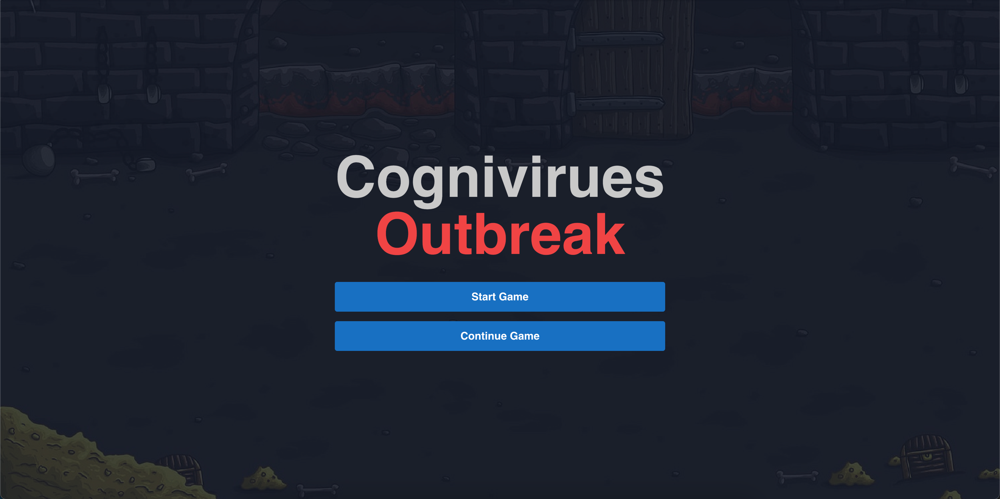
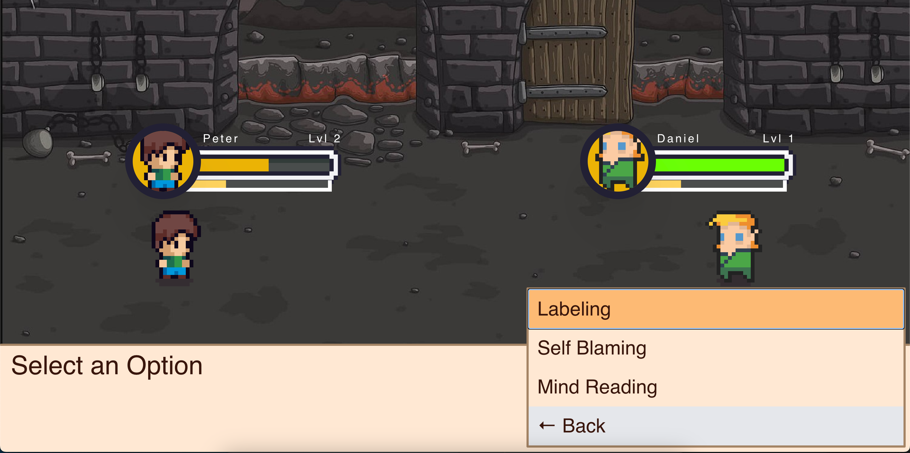
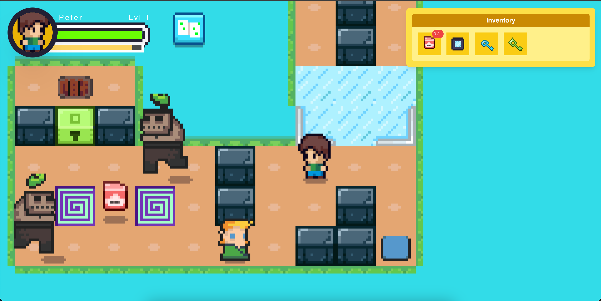

# Web-Based AI Powered RPG Game

Empowering users to identify and manage cognitive distortions – negative and inaccurate thought patterns – through a fun and addictive gameplay.

## Features

- **Engaging RPG Mechanics**: 8-bit dungeon crawler with turn-based combat, puzzles, and interactive storytelling.
- **AI-Powered Journaling**: Write daily journals that are analyzed by AI to detect cognitive distortions and provide feedback.
- **Personalized Enemeies**: The AI generates enemies based on the player's thoughts and experiences, creating "battling your own thoughts" experience.

## Screenshots

### Main Menu



### Battle Scene



### Puzzle Gameplay



## Getting Started

1. Clone the repository:
   ```sh
   git clone https://github.com/thesyamsulzaman/cognivirues-outbreak.git
   cd your-repo
   ```
2. Install dependencies:
   ```sh
   cd client/ && npm install
   cd server/ && npm install
   ```
3. Start the development server:
   ```sh
   cd client/ && npm run dev
   cd server/ && npm run run:dev
   ```

## Technologies Used

- **Frontend**: React.js, TypeScript, HTML5 Canvas
- **Backend**: Node.js, Express.js, PostgreSQL, Prisma
- **AI Integration**: OpenAI API
- **Deployment**: Docker, AWS EC2

## Contributing

Feel free to contribute! Fork the repo, make your changes, and submit a pull request.

## License

This project is licensed under the MIT License.
